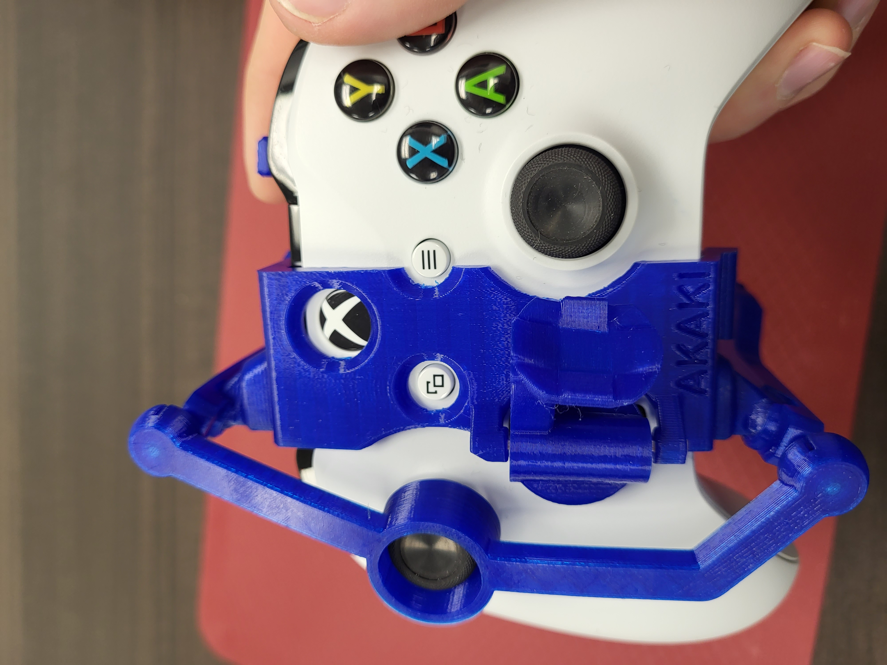

<!--- 
Open Source Assistive Technology: GitHub Readme Template
 --->

<!---
INSTRUCTIONS
This is a markdown template for creating the README.md file in a GitHub repository. This file is rendered and displayed automatically when someone visits the repository.

This document includes helper text that will not be displayed when rendered. Any text between the less-than sign + exclamation mark + three hyphen-minus (<!---) and matching three hyphen-minus + greater-than sign will not be displayed. This helper text can be deleted once the corresponding section is completed.

 --->
 
 <!--- 
TITLE
Should match the name of the GitHub repository. Choose something descriptive rather than whimsical. 
 --->
 # One-Handed Mods for Xbox One Controller

<!--- 
SUMMARY
A brief summary of the project. What it does, who it is for, how much it costs.
 --->
This inexpensive 3D printed modification for the Xbox One controller will allow for the user to operate their Xbox One controller with one hand. This controller adaptation makes it easier for someone who may have a difficult time holding a controller with both hands, or has greater dexterity with one hand than the other.

<!--- 
PHOTO

 --->

<!--- 
## More info at
 - [Makers Making Change Forum Thread](https://makersmakingchange.com/forum/topic/one-handed-mods-for-xbox-one-controller/) 
 - [Makers Making Change Project Page](https://makersmakingchange.com/project/one-handed-mods-for-xbox-one-controller/)
 --->

## Getting Started
<!--- 
Include an overall idea of what major steps are required to build the device.
 --->

### 1. Print the 3D Printable components
Print the components for the switch tester case and choose an option for the case.

All of the files and individual print files can be in the [/Build_Files/3D_Printing_Files](/Build_Files/3D_Printing_Files/) folder.

### 2. Assemble the One-Handed Mod for Xbox One Controller
Reference the Assembly Guides in the [Documentation](/Documentation) folder for the tools and steps required to build each portion.

## Files
<!---
FILES
This section includes all the information and files required to build and modify the device, including documentation, design files, and build files. 
--->

### Documentation
<!---
DOCUMENTATION

--->
| Document | Version | Link |
|----------|---------|------|
| Bill of Materials    | 1.0 | [One-Handed_Mods_BOM](/Documentation/Working_Documents/One-Handed_Mods_for_Xbox_One_Controller_BOM.xlsx) |
| Left-Hand Mod Assembly Guide       | 1.0 | [Left-Hand_Mod_Instructions](/Documentation/Left-Handed_Mod_for_Xbox_One_Controller_Assembly_Guide.pdf) |
| Right-Hand Mod Assembly Guide       | 1.0 | [Right-Hand_Mod_Instructions](/Documentation/Right-Handed_Mod_for_Xbox_One_Controller_Assembly_Guide.pdf) |
| Maker Checklist      | 1.0 | [One-Handed_Mods_Checklist](/Documentation/One-Handed_Mods_for_Xbox_One_Controller_Maker_Checklist.pdf) |
| User Quick Guide          | 1.0 | [One-Handed_Mods_Quick_Guide](/Documentation/One-Handed_Mods_for_Xbox_One_Controller_User_Guide.pdf)        |
| Changelog            | 1.0 | [One-Handed_Mods_Changelog](/Documentation/One-Handed_Mods_for_Xbox_One_Controller_Changelog.pdf)               |

### Build Files
<!---
BUILD FILES
This section i
--->
 - [3D Printing Files](/Build_Files/3D_Printing)

## License
<!---
LICENSE
Choose an appropriate license. We recommend an open-source hardware compatible license.
--->
Everything needed or used to design, make, test, or prepare the One-Handed Mods for Xbox One Controller is licensed under a Creative Commons Attribution-NonCommercial-ShareAlike 4.0 International license.

Accompanying material by Makers Making Change, such as instruction manuals, are published under a Creative Commons Attribution-ShareAlike 4.0 license <https://creativecommons.org/licenses/by-sa/4.0/> (CC BY-SA 4.0).

## Attribution
<!---
ATTRIBUTION
Include any information related to the development of the design. This may include who identified the initial challenge, who contributed to the design
--->
Designed and remixed by [Akaki](https://www.printables.com/social/106360-akaki/about).

The documentation template was created by Makers Making Change and is used under a CC BY-SA 4.0 license. It is available at the following link: https://github.com/makersmakingchange/OpenAT-Template

## About Makers Making Change

Makers Making Change is an initiative of [Neil Squire](https://www.neilsquire.ca/), a Canadian non-profit that uses technology, knowledge, and passion to empower people with disabilities.

We are committed to cultivating a network of volunteer makers who support people with disabilities in their communities through cost effective assistive technology. Check out our library of free, open-source assistive technologies.

 - Website: [www.MakersMakingChange.com](https://www.makersmakingchange.com/)
 - [GitHub](https://github.com/makersmakingchange)
 - [Thingiverse](https://www.thingiverse.com/makersmakingchange/about)
 - Twitter: [@makermakechange](https://twitter.com/makermakechange)
 - Instagram: [@makersmakingchange](https://www.instagram.com/makersmakingchange)

### Contact Us
For technical questions, to get involved, or to share your experience we encourage you to visit [MMC Forum](https://forum.makersmakingchange.com) or contact info@makersmakingchange.com
